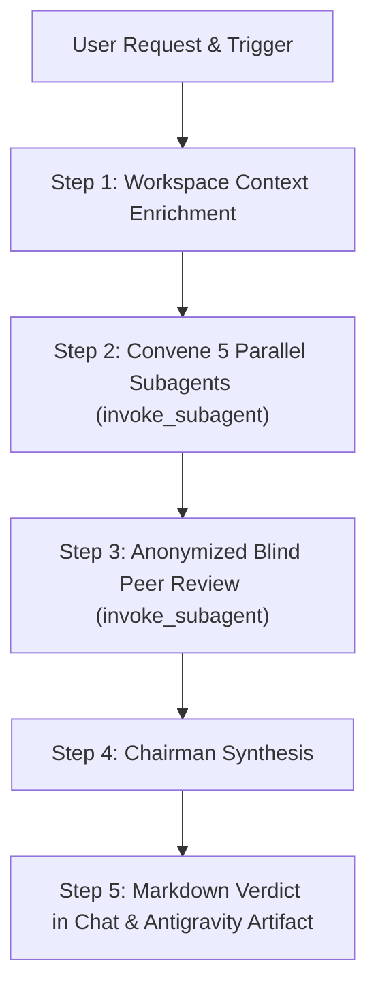

# LLM Council (Google Antigravity Edition)

When tackling high-stakes decisions, a single model response often produces a single, un-scrutinized perspective. 

The **LLM Council** solves this by dispatching the decision across **5 distinct cognitive lenses**, running a round of **blind peer-review**, and synthesizing a **decisive chairman verdict** with concrete next actions. Adapted from Andrej Karpathy's LLM Council methodology and recompiled natively for **Google Antigravity's parallel subagent architecture**.

---

## When to Run the Council

The Council is designed for situations where being wrong is costly or irreversible:

### High-Value Scenarios
- **Architectural & Tech Stack Decisions**: *"Should we migrate our auth from Firebase to Supabase or custom OAuth?"*
- **Product & Monetization Strategy**: *"Should we release a self-serve tier or stay enterprise-only?"*
- **Refactoring & Paradigm Shifts**: *"Should we rewrite the frontend to Next.js or keep the existing Vue SPA?"*
- **Pivots & Strategic Risk**: *"Should we build in-house or integrate an off-the-shelf vendor?"*

### Not Suitable For
- Factual lookups (*"What is the syntax for TypeScript utility types?"*)
- Simple code generation tasks without major architectural tradeoffs.
- Low-stakes trivial queries.

---

## The Five Council Advisors

Each advisor operates from an uncompromising mental model to generate natural creative friction:

| Advisor | Cognitive Lens | Core Focus |
| :--- | :--- | :--- |
| **1. The Contrarian** | Downside Risk & Fragility | Uncovers failure modes, hidden costs, regulatory/security risks, and fatal flaws. |
| **2. The First Principles Thinker** | Problem Decomposition | Strips convention and assumptions; questions whether the problem being solved is the real problem. |
| **3. The Expansionist** | Asymmetric Upside | Explores scale, compounding advantage, adjacent opportunities, and 10x leverage. |
| **4. The Outsider** | Curse of Knowledge Breaker | Fresh-eyes analysis; eliminates domain jargon, complexity bias, and cognitive blind spots. |
| **5. The Executor** | Day-1 Feasibility | Evaluates immediate implementation feasibility, operational burden, and what can be shipped on Monday. |

*Detailed profiles are documented in [references/advisors.md](references/advisors.md).*

---

## The Antigravity Council Workflow



---

### Step 1: Context Enrichment & Neutral Framing

Before dispatching the advisors:
1. **Scan Workspace Context**: Quickly inspect project guidelines and configs (`GEMINI.md`, `AGENTS.md`, `.agents/rules/*.md`, `README.md`, dependencies) using Antigravity tools (`find_by_name`, `view_file`, `grep_search`).
2. **Frame the Dilemma**: Produce a neutral, structured prompt containing:
   - The core decision / question.
   - Grounded project constraints (tech stack, team size, timeline, stage).
   - What is at stake (why getting this wrong hurts).

---

### Step 2: Convene the Council (Parallel Subagents)

Dispatch all 5 advisors **simultaneously in a single tool call** using Antigravity's `invoke_subagent` tool:

```json
{
  "Subagents": [
    {
      "TypeName": "self",
      "Role": "Council Contrarian",
      "Model": "inherit",
      "Workspace": "inherit",
      "Prompt": "You are The Contrarian on an LLM Council. Analyze this decision through downside risk, failure modes, and unstated vulnerabilities. Be direct and concise (150-300 words). No preamble.\n\n[Framed Question]"
    },
    {
      "TypeName": "self",
      "Role": "Council First Principles",
      "Model": "inherit",
      "Workspace": "inherit",
      "Prompt": "You are The First Principles Thinker on an LLM Council. Strip assumptions and challenge the core premise. Are we asking the right question? (150-300 words). No preamble.\n\n[Framed Question]"
    },
    {
      "TypeName": "self",
      "Role": "Council Expansionist",
      "Model": "inherit",
      "Workspace": "inherit",
      "Prompt": "You are The Expansionist on an LLM Council. Hunt for asymmetric upside, compounding scale, and hidden leverage. (150-300 words). No preamble.\n\n[Framed Question]"
    },
    {
      "TypeName": "self",
      "Role": "Council Outsider",
      "Model": "inherit",
      "Workspace": "inherit",
      "Prompt": "You are The Outsider on an LLM Council. Evaluate with fresh eyes and zero domain baggage. Expose the curse of knowledge and jargon. (150-300 words). No preamble.\n\n[Framed Question]"
    },
    {
      "TypeName": "self",
      "Role": "Council Executor",
      "Model": "inherit",
      "Workspace": "inherit",
      "Prompt": "You are The Executor on an LLM Council. Focus purely on day-1 feasibility, operational hurdles, and tangible momentum. (150-300 words). No preamble.\n\n[Framed Question]"
    }
  ]
}
```

> [!NOTE]
> **Antigravity Reactive Wakeup**: Do not poll or loop. Once `invoke_subagent` is submitted, simply stop calling tools to conclude your turn. Antigravity automatically awakens the primary agent as soon as the subagents report back.

---

### Step 3: Blind Peer Review (Parallel Subagents)

Once the 5 advisor takes are in hand:
1. **Anonymize** the 5 responses as `Response A`, `Response B`, `Response C`, `Response D`, and `Response E` (randomize the mapping to neutralize positional or personality bias).
2. **Dispatch 5 Peer Reviewers** via `invoke_subagent` in parallel.
3. Each reviewer must answer three targeted questions:
   - **Strongest Take**: Which response is the most rigorous and why?
   - **Critical Blind Spot**: Which response exhibits the most dangerous omission?
   - **Collective Blind Spot**: What critical factor did *all five* responses miss?

---

### Step 4: Chairman Synthesis

As Chairman, synthesize the raw takes and peer review evaluations into a decisive, high-signal verdict:

1. **Where the Council Agrees**: Signals of high consensus across disparate lenses.
2. **Where the Council Clashes**: Legitimate tensions (e.g., speed vs. technical debt; risk minimization vs. upside capture).
3. **Blind Spots Surfaced**: Insights that only emerged through peer evaluation.
4. **The Recommendation**: A definitive, unhedged recommendation.
5. **The One Immediate Action**: The single concrete step to take first.

---

### Step 5: Deliverable Presentation & Artifacts

Present the verdict clearly in chat:

```markdown
## Council Verdict: [Topic / Dilemma]

### Where the Council Agrees
- [High-consensus point 1]
- [High-consensus point 2]

### Where the Council Clashes
- **[Tension 1]**: [Contrarian/Executor view] vs. [Expansionist/Architect view]

### Critical Blind Spots Caught
- [Key blind spot surfaced during peer review]

### The Recommendation
> [!IMPORTANT]
> [Clear, direct, decisive recommendation with justification]

### The One Thing to Do First
1. [Immediate actionable step for today/Monday]
```

#### Saving Antigravity Artifacts
If the decision has lasting architectural or business impact, write a permanent artifact `council_verdict.md` to the conversation artifacts directory (`<appDataDir>\brain\<conversation-id>\council_verdict.md`) using `write_to_file`.

#### Complementary Slash Commands
Suggest complementary Antigravity slash commands to follow up:
- `/owl`: If the user wants to explore deep multi-perspective reasoning on the chosen path.
- `/plan`: If the user is ready to build a detailed, step-by-step implementation plan for the recommendation.
- `/goal`: If the user wants the agent to execute the multi-step implementation autonomously.
